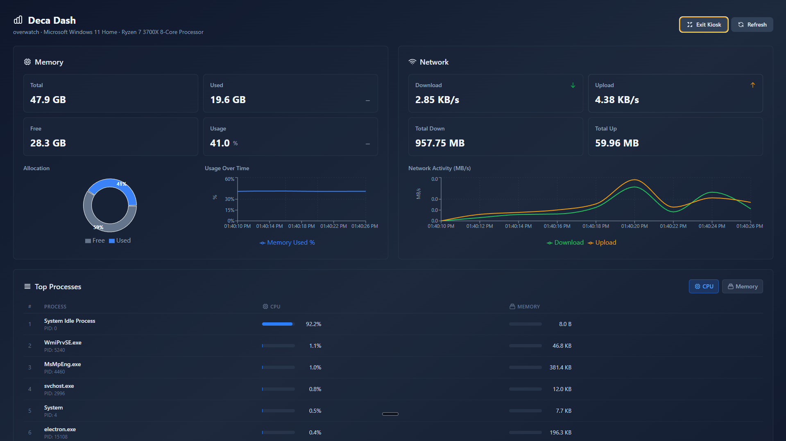
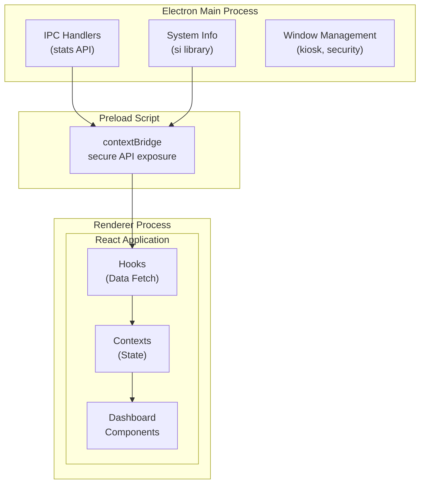

# Deca Dash

A modern, extensible real-time system monitoring dashboard built with React 19, Vite 7, TypeScript, and Electron 40. Features memory, network, and process monitoring with interactive charts and a clean, responsive UI.



## Features

- **Real-time System Monitoring**: Memory, network, and process stats updated every 2 seconds
- **Top Processes Widget**: View top 10 processes by CPU or memory usage
- **Interactive Charts**: Line graphs and pie charts powered by Recharts
- **Kiosk Mode**: Fullscreen distraction-free monitoring
- **Modern Stack**: React 19.2.4, Vite 7.3.1, Electron 40.1.0, TypeScript 5.7
- **SOLID Architecture**: Feature-based modular design with dependency injection
- **Tailwind CSS v4**: Modern utility-first styling with Vite plugin
- **Comprehensive Testing**: Vitest with React Testing Library
- **CI/CD Ready**: GitHub Actions workflow included
- **Electron Security**: Context isolation, CSP, secure IPC

## Quick Start

```bash
# Install dependencies (requires Node.js 20+)
npm install

# Start web development server
npm run dev

# Start desktop development (with system monitoring)
npm run dev:desktop

# Run tests
npm run test

# Build for production
npm run build:desktop
```

## Scripts

| Script | Description |
|--------|-------------|
| `npm run dev` | Start Vite dev server (web preview) |
| `npm run dev:desktop` | Start Electron with hot-reload |
| `npm run build` | Build web application |
| `npm run build:desktop` | Build Electron for all platforms |
| `npm run build:desktop:win` | Build for Windows |
| `npm run build:desktop:mac` | Build for macOS |
| `npm run build:desktop:linux` | Build for Linux |
| `npm run test` | Run tests in watch mode |
| `npm run test:run` | Run tests once |
| `npm run test:coverage` | Run tests with coverage |
| `npm run lint` | Run ESLint |

## Documentation

| Document | Description |
|----------|-------------|
| [Architecture](docs/ARCHITECTURE.md) | System design and SOLID principles |
| [API Reference](docs/API.md) | IPC handlers, Electron API, type definitions |
| [Extension Guide](docs/EXTENSION-GUIDE.md) | How to add new data sources and widgets |
| [Dashboard Types](docs/DASHBOARD-TYPES.md) | Building REST, DBUS, and monitoring dashboards |
| [Contributing](docs/CONTRIBUTING.md) | Development workflow and guidelines |

## Project Structure

```
├── electron/                 # Electron main process
│   ├── main.ts              # App lifecycle, security, IPC handlers
│   └── preload.ts           # Secure API bridge
├── src/
│   ├── features/            # Feature modules
│   │   └── dashboard/       # System stats dashboard
│   │       ├── components/  # UI components
│   │       ├── hooks/       # Data fetching hooks
│   │       ├── context/     # State management
│   │       └── types/       # TypeScript interfaces
│   ├── shared/              # Shared utilities
│   │   ├── context/         # App-wide contexts
│   │   ├── lib/             # Utility functions
│   │   └── types/           # Shared type definitions
│   ├── test/                # Test utilities and mocks
│   └── main.tsx             # Entry point
├── docs/                    # Documentation
└── .github/workflows/       # CI/CD configuration
```

## Tech Stack

| Technology | Version | Purpose |
|------------|---------|---------|
| React | 19.2.4 | UI framework |
| Vite | 7.3.1 | Build tool |
| Electron | 40.1.0 | Desktop framework |
| TypeScript | 5.7 | Type safety |
| Tailwind CSS | 4.1 | Styling |
| Recharts | 2.x | Data visualization |
| systeminformation | 5.x | System stats |
| Vitest | 4.0 | Testing |
| electron-builder | 26.7 | App packaging |

## Architecture Overview

Deca Dash follows SOLID principles and a feature-based modular architecture:



## Security

Electron security features enabled:

- `nodeIntegration: false` - No Node.js in renderer
- `contextIsolation: true` - Isolated contexts
- Content Security Policy headers
- Navigation restriction to trusted origins
- Secure IPC via contextBridge

## Requirements

- Node.js 20+
- npm 10+

## License

MIT License - see [LICENSE](LICENSE)
