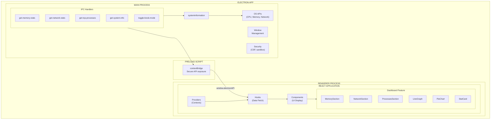
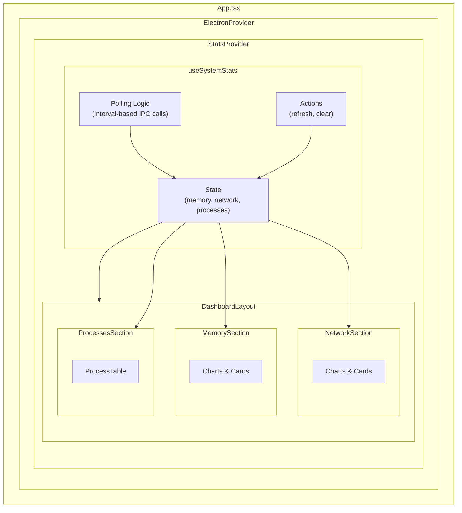
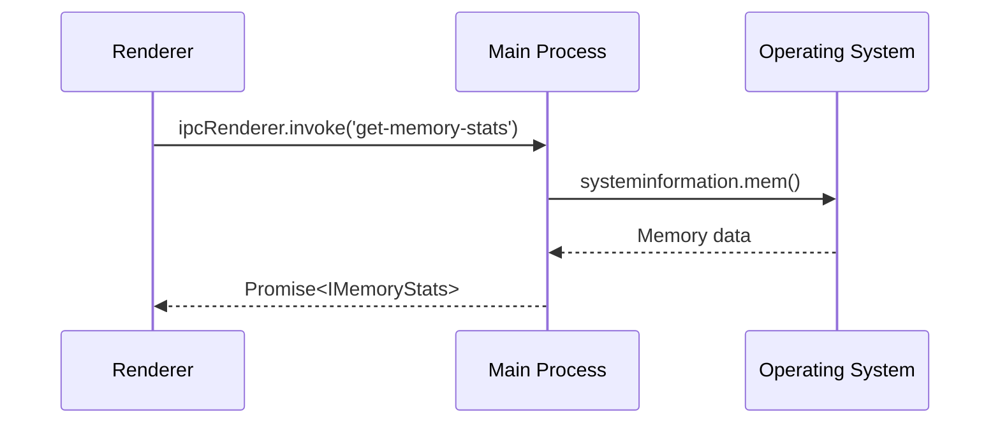

# Architecture Documentation

This document describes the architectural decisions and patterns used in Deca Dash.

## Overview

Deca Dash follows a feature-based modular architecture with SOLID principles, enabling easy extension and maintenance. The application is built on the Electron framework, providing both a web preview and a full-featured desktop application with system-level access.

## System Architecture



## Project Structure

```
├── electron/                 # Electron main process
│   ├── main.ts              # Application entry, IPC handlers, security
│   └── preload.ts           # Secure bridge to renderer
├── src/
│   ├── features/            # Feature modules
│   │   └── dashboard/       # System monitoring dashboard
│   │       ├── components/  # React components (sections, charts, cards)
│   │       ├── hooks/       # Data fetching (useSystemStats)
│   │       ├── context/     # State management (StatsContext)
│   │       ├── types/       # TypeScript interfaces
│   │       └── index.ts     # Barrel export
│   ├── shared/              # Shared utilities
│   │   ├── context/         # App-wide contexts (ElectronContext)
│   │   ├── lib/             # Utility functions
│   │   ├── types/           # Shared types (ElectronAPI)
│   │   └── index.ts         # Barrel export
│   ├── test/                # Test utilities
│   │   ├── mocks/           # Mock implementations
│   │   └── setup.ts         # Test configuration
│   ├── App.tsx              # Root component
│   └── main.tsx             # React entry point
├── docs/                    # Documentation
└── .github/workflows/       # CI/CD configuration
```

## SOLID Principles

### Single Responsibility (SRP)

Each module has a single, well-defined purpose:

| Module | Responsibility |
|--------|---------------|
| `MemorySection` | Display memory statistics only |
| `NetworkSection` | Display network statistics only |
| `ProcessesSection` | Display process list only |
| `useSystemStats` | Fetch and manage system stats |
| `StatsContext` | Provide stats to component tree |
| `LineGraph` | Render line chart visualization |
| `PieChart` | Render pie chart visualization |
| `StatCard` | Render single metric card |

### Open/Closed Principle (OCP)

Components are configurable without modification:

```typescript
// LineGraph is open for extension via props
<LineGraph
  data={history}
  lines={[
    { dataKey: 'cpu', name: 'CPU', color: '#3b82f6' },
    { dataKey: 'memory', name: 'Memory', color: '#22c55e' },
  ]}
  dataAccessor={(point, key) => point[key]}
  height={200}
/>

// Add new metrics without modifying LineGraph component
```

### Liskov Substitution (LSP)

All chart data follows the same interface pattern:

```typescript
// Any component providing IPieSegment[] works with PieChart
interface IPieSegment {
  name: string;
  value: number;
  color: string;
}

// Memory allocation, disk usage, process distribution - all use same interface
```

### Interface Segregation (ISP)

Interfaces are small and focused:

```typescript
interface IMemoryStats {
  total: number;
  used: number;
  free: number;
  usedPercent: number;
}

interface INetworkStats {
  rxBytes: number;
  txBytes: number;
  rxSec: number;
  txSec: number;
}

// Each interface has only what's needed for its purpose
```

### Dependency Inversion (DIP)

Components depend on abstractions (Context) not implementations:

```typescript
// Component depends on context abstraction
function MemorySection() {
  const { memory, isLoading } = useStats();  // From context
  return <MemoryDisplay data={memory} />;
}

// Not directly on:
// window.electronAPI.getMemoryStats() // Direct dependency - avoid
```

## Data Flow



## IPC Communication

The main process and renderer communicate via IPC (Inter-Process Communication):



### Security Model

1. **Context Isolation**: Renderer is isolated from Node.js
2. **Preload Script**: Only exposes specific, validated APIs
3. **No Node Integration**: `nodeIntegration: false`
4. **CSP Headers**: Restricts resource loading
5. **Navigation Restriction**: Only trusted origins allowed

## Electron Security

### Configuration

```typescript
// electron/main.ts
webPreferences: {
  preload: join(__dirname, 'preload.js'),
  nodeIntegration: false,      // No Node.js in renderer
  contextIsolation: true,      // Separate contexts
  sandbox: false,              // For IPC access
  webSecurity: true,           // Enable web security
  allowRunningInsecureContent: false,
}
```

### Content Security Policy

```typescript
// Development
"default-src 'self' 'unsafe-inline' 'unsafe-eval'; ..."

// Production
"default-src 'self'; script-src 'self'; style-src 'self' 'unsafe-inline'; ..."
```

## Testing Strategy

### Test Categories

| Category | Location | Purpose |
|----------|----------|---------|
| Unit Tests | `__tests__/*.test.ts` | Test hooks, utilities |
| Component Tests | `__tests__/*.test.tsx` | Test React components |
| Integration Tests | `__tests__/*.test.tsx` | Test feature flows |
| Mock Utilities | `src/test/mocks/` | Electron API mocks |

### Testing Without Electron

```typescript
// Setup Electron mock
import { setupElectronMock, clearElectronMock } from '@/test/mocks/electron';

beforeEach(() => {
  setupElectronMock();  // Simulates Electron environment
});

afterEach(() => {
  clearElectronMock();  // Cleanup
});
```

## Path Aliases

```typescript
// Available aliases (configured in tsconfig.app.json)
import { DashboardLayout, useStats } from '@features/dashboard';
import { isElectron, ElectronProvider } from '@shared/index';
import { mockElectronAPI } from '@/test/mocks/electron';
```

## Adding New Features

1. **Create feature directory**: `src/features/my-feature/`
2. **Add components**: `components/MyComponent.tsx`
3. **Add hooks**: `hooks/useMyData.ts`
4. **Add types**: `types/my-feature.types.ts`
5. **Add context** (if needed): `context/MyContext.tsx`
6. **Create barrel export**: `index.ts`
7. **Add IPC handlers** (if needed): `electron/main.ts`
8. **Update preload**: `electron/preload.ts`
9. **Add tests**: `__tests__/` directories

See [EXTENSION-GUIDE.md](EXTENSION-GUIDE.md) for detailed instructions.
