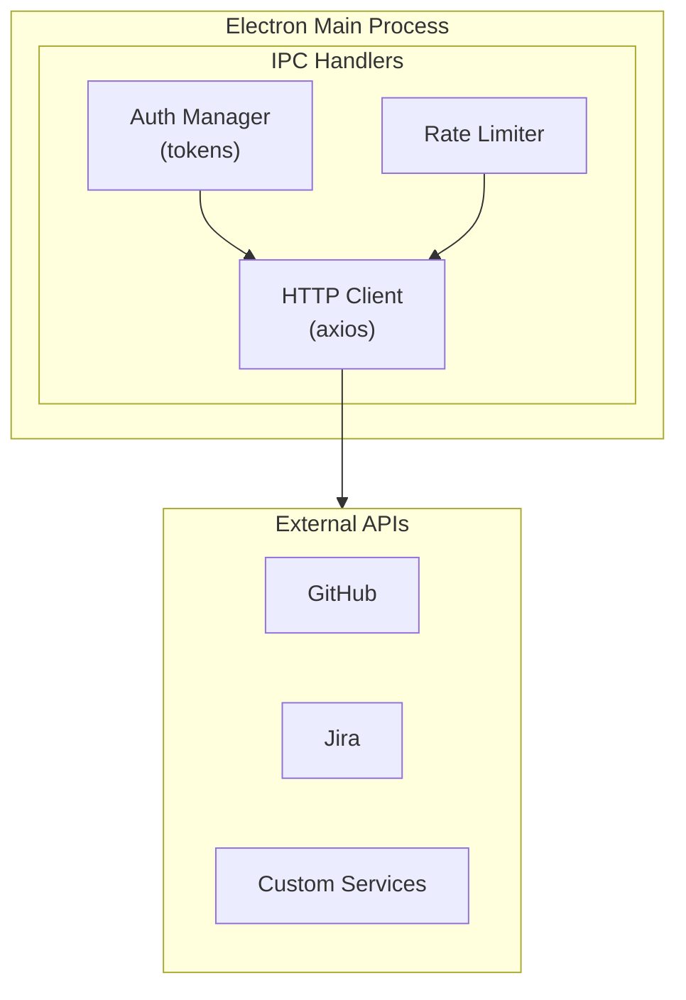
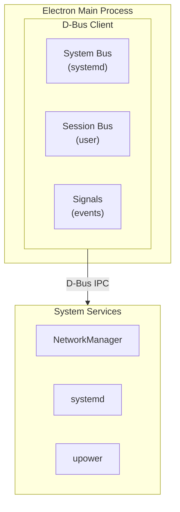

# Building Different Dashboard Types

This guide shows how to adapt Deca Dash for various use cases including REST API dashboards, D-Bus integration, general monitoring solutions, and more.

## Table of Contents

- [REST API Dashboard](#rest-api-dashboard)
- [D-Bus Integration (Linux)](#d-bus-integration-linux)
- [WebSocket Real-Time Dashboard](#websocket-real-time-dashboard)
- [Docker/Container Monitoring](#dockercontainer-monitoring)
- [Database Monitoring](#database-monitoring)
- [IoT Device Dashboard](#iot-device-dashboard)
- [Log Monitoring Dashboard](#log-monitoring-dashboard)
- [Cloud Service Dashboard](#cloud-service-dashboard)

---

## REST API Dashboard

Build dashboards that fetch data from REST APIs (internal or external services).

### Architecture



### Implementation

#### 1. Install HTTP Client

```bash
npm install axios
```

#### 2. Create API Service (Main Process)

```typescript
// electron/services/apiService.ts
import axios, { AxiosInstance } from 'axios';

interface ApiConfig {
  baseUrl: string;
  apiKey?: string;
  timeout?: number;
}

export function createApiClient(config: ApiConfig): AxiosInstance {
  const client = axios.create({
    baseURL: config.baseUrl,
    timeout: config.timeout || 10000,
    headers: config.apiKey ? {
      'Authorization': `Bearer ${config.apiKey}`,
    } : {},
  });

  // Response interceptor for error handling
  client.interceptors.response.use(
    response => response,
    error => {
      console.error('API Error:', error.message);
      throw error;
    }
  );

  return client;
}
```

#### 3. Create IPC Handlers

```typescript
// electron/main.ts
import { createApiClient } from './services/apiService';

// Configure your API client
const api = createApiClient({
  baseUrl: process.env.API_BASE_URL || 'https://api.example.com',
  apiKey: process.env.API_KEY,
});

// Fetch dashboard data from REST API
ipcMain.handle('api-get-metrics', async (_event, endpoint: string) => {
  try {
    const response = await api.get(endpoint);
    return response.data;
  } catch (error) {
    console.error('Error fetching metrics:', error);
    return null;
  }
});

// POST data to REST API
ipcMain.handle('api-post-data', async (_event, endpoint: string, data: unknown) => {
  try {
    const response = await api.post(endpoint, data);
    return response.data;
  } catch (error) {
    console.error('Error posting data:', error);
    return null;
  }
});

// Batch fetch multiple endpoints
ipcMain.handle('api-batch-fetch', async (_event, endpoints: string[]) => {
  try {
    const promises = endpoints.map(ep => api.get(ep).then(r => r.data));
    const results = await Promise.all(promises);
    return results;
  } catch (error) {
    console.error('Error in batch fetch:', error);
    return null;
  }
});
```

#### 4. Create Custom Hook

```typescript
// src/features/api-dashboard/hooks/useApiData.ts
import { useState, useEffect, useCallback } from 'react';

interface UseApiDataOptions<T> {
  endpoint: string;
  pollInterval?: number;
  transform?: (data: unknown) => T;
}

export function useApiData<T>({ 
  endpoint, 
  pollInterval, 
  transform 
}: UseApiDataOptions<T>) {
  const [data, setData] = useState<T | null>(null);
  const [isLoading, setIsLoading] = useState(true);
  const [error, setError] = useState<string | null>(null);

  const fetchData = useCallback(async () => {
    try {
      const result = await window.electronAPI?.apiGetMetrics(endpoint);
      if (result) {
        setData(transform ? transform(result) : result as T);
        setError(null);
      }
    } catch (err) {
      setError(err instanceof Error ? err.message : 'Unknown error');
    } finally {
      setIsLoading(false);
    }
  }, [endpoint, transform]);

  useEffect(() => {
    fetchData();
    
    if (pollInterval) {
      const interval = setInterval(fetchData, pollInterval);
      return () => clearInterval(interval);
    }
  }, [fetchData, pollInterval]);

  return { data, isLoading, error, refresh: fetchData };
}
```

#### 5. Example: GitHub Stats Dashboard

```typescript
// src/features/github-dashboard/components/GitHubSection.tsx
import { useApiData } from '../hooks/useApiData';

interface GitHubRepo {
  name: string;
  stars: number;
  forks: number;
  openIssues: number;
}

export function GitHubSection() {
  const { data: repos, isLoading, error } = useApiData<GitHubRepo[]>({
    endpoint: '/user/repos',
    pollInterval: 60000, // Update every minute
    transform: (data) => (data as any[]).map(repo => ({
      name: repo.name,
      stars: repo.stargazers_count,
      forks: repo.forks_count,
      openIssues: repo.open_issues_count,
    })),
  });

  if (isLoading) return <div>Loading...</div>;
  if (error) return <div>Error: {error}</div>;

  return (
    <div className="grid grid-cols-2 gap-4">
      {repos?.map(repo => (
        <div key={repo.name} className="p-4 bg-slate-800 rounded-lg">
          <h3 className="font-bold">{repo.name}</h3>
          <p>⭐ {repo.stars} | 🍴 {repo.forks} | 🐛 {repo.openIssues}</p>
        </div>
      ))}
    </div>
  );
}
```

---

## D-Bus Integration (Linux)

Build dashboards that communicate with system services via D-Bus on Linux.

### Architecture



### Implementation

#### 1. Install D-Bus Library

```bash
npm install dbus-next
```

#### 2. Create D-Bus Service

```typescript
// electron/services/dbusService.ts
import dbus from 'dbus-next';

let systemBus: dbus.MessageBus | null = null;
let sessionBus: dbus.MessageBus | null = null;

export async function getSystemBus(): Promise<dbus.MessageBus> {
  if (!systemBus) {
    systemBus = dbus.systemBus();
  }
  return systemBus;
}

export async function getSessionBus(): Promise<dbus.MessageBus> {
  if (!sessionBus) {
    sessionBus = dbus.sessionBus();
  }
  return sessionBus;
}

// Get NetworkManager state
export async function getNetworkState(): Promise<string> {
  const bus = await getSystemBus();
  const obj = await bus.getProxyObject(
    'org.freedesktop.NetworkManager',
    '/org/freedesktop/NetworkManager'
  );
  const props = obj.getInterface('org.freedesktop.DBus.Properties');
  const state = await props.Get('org.freedesktop.NetworkManager', 'State');
  
  const states: Record<number, string> = {
    0: 'Unknown',
    10: 'Asleep',
    20: 'Disconnected',
    30: 'Disconnecting',
    40: 'Connecting',
    50: 'Connected (Local)',
    60: 'Connected (Site)',
    70: 'Connected (Global)',
  };
  
  return states[state.value] || 'Unknown';
}

// Get systemd service status
export async function getServiceStatus(serviceName: string): Promise<{
  active: string;
  subState: string;
  description: string;
}> {
  const bus = await getSystemBus();
  const manager = await bus.getProxyObject(
    'org.freedesktop.systemd1',
    '/org/freedesktop/systemd1'
  );
  
  const managerIface = manager.getInterface('org.freedesktop.systemd1.Manager');
  const unitPath = await managerIface.GetUnit(`${serviceName}.service`);
  
  const unit = await bus.getProxyObject('org.freedesktop.systemd1', unitPath);
  const props = unit.getInterface('org.freedesktop.DBus.Properties');
  
  const [active, subState, description] = await Promise.all([
    props.Get('org.freedesktop.systemd1.Unit', 'ActiveState'),
    props.Get('org.freedesktop.systemd1.Unit', 'SubState'),
    props.Get('org.freedesktop.systemd1.Unit', 'Description'),
  ]);
  
  return {
    active: active.value,
    subState: subState.value,
    description: description.value,
  };
}

// Get battery info via UPower
export async function getBatteryInfo(): Promise<{
  percentage: number;
  state: string;
  timeToEmpty: number;
}> {
  const bus = await getSystemBus();
  const obj = await bus.getProxyObject(
    'org.freedesktop.UPower',
    '/org/freedesktop/UPower/devices/battery_BAT0'
  );
  const props = obj.getInterface('org.freedesktop.DBus.Properties');
  
  const [percentage, state, timeToEmpty] = await Promise.all([
    props.Get('org.freedesktop.UPower.Device', 'Percentage'),
    props.Get('org.freedesktop.UPower.Device', 'State'),
    props.Get('org.freedesktop.UPower.Device', 'TimeToEmpty'),
  ]);
  
  const states: Record<number, string> = {
    1: 'Charging',
    2: 'Discharging',
    3: 'Empty',
    4: 'Fully Charged',
    5: 'Pending Charge',
    6: 'Pending Discharge',
  };
  
  return {
    percentage: percentage.value,
    state: states[state.value] || 'Unknown',
    timeToEmpty: timeToEmpty.value,
  };
}
```

#### 3. Create IPC Handlers

```typescript
// electron/main.ts
import { getNetworkState, getServiceStatus, getBatteryInfo } from './services/dbusService';

// Only register D-Bus handlers on Linux
if (process.platform === 'linux') {
  ipcMain.handle('dbus-network-state', async () => {
    try {
      return await getNetworkState();
    } catch (error) {
      console.error('D-Bus network error:', error);
      return null;
    }
  });

  ipcMain.handle('dbus-service-status', async (_event, serviceName: string) => {
    try {
      return await getServiceStatus(serviceName);
    } catch (error) {
      console.error('D-Bus service error:', error);
      return null;
    }
  });

  ipcMain.handle('dbus-battery-info', async () => {
    try {
      return await getBatteryInfo();
    } catch (error) {
      console.error('D-Bus battery error:', error);
      return null;
    }
  });
}
```

---

## WebSocket Real-Time Dashboard

Build dashboards with real-time WebSocket connections for live data streams.

### Implementation

#### 1. Create WebSocket Service

```typescript
// electron/services/websocketService.ts
import WebSocket from 'ws';
import { BrowserWindow } from 'electron';

interface WebSocketConfig {
  url: string;
  reconnectInterval?: number;
  maxReconnectAttempts?: number;
}

export class WebSocketService {
  private ws: WebSocket | null = null;
  private config: WebSocketConfig;
  private reconnectAttempts = 0;
  private messageChannel: string;

  constructor(config: WebSocketConfig, messageChannel: string) {
    this.config = {
      reconnectInterval: 5000,
      maxReconnectAttempts: 10,
      ...config,
    };
    this.messageChannel = messageChannel;
  }

  connect(): void {
    this.ws = new WebSocket(this.config.url);

    this.ws.on('open', () => {
      console.log('WebSocket connected');
      this.reconnectAttempts = 0;
      this.sendToRenderer('ws-connected', { url: this.config.url });
    });

    this.ws.on('message', (data) => {
      try {
        const parsed = JSON.parse(data.toString());
        this.sendToRenderer(this.messageChannel, parsed);
      } catch {
        this.sendToRenderer(this.messageChannel, { raw: data.toString() });
      }
    });

    this.ws.on('close', () => {
      console.log('WebSocket disconnected');
      this.sendToRenderer('ws-disconnected', {});
      this.attemptReconnect();
    });

    this.ws.on('error', (error) => {
      console.error('WebSocket error:', error);
      this.sendToRenderer('ws-error', { message: error.message });
    });
  }

  private attemptReconnect(): void {
    if (this.reconnectAttempts < (this.config.maxReconnectAttempts || 10)) {
      this.reconnectAttempts++;
      setTimeout(() => this.connect(), this.config.reconnectInterval);
    }
  }

  private sendToRenderer(channel: string, data: unknown): void {
    const windows = BrowserWindow.getAllWindows();
    windows.forEach(win => {
      win.webContents.send(channel, data);
    });
  }

  send(data: unknown): void {
    if (this.ws?.readyState === WebSocket.OPEN) {
      this.ws.send(JSON.stringify(data));
    }
  }

  disconnect(): void {
    this.ws?.close();
    this.ws = null;
  }
}
```

#### 2. Preload WebSocket Events

```typescript
// electron/preload.ts
import { ipcRenderer } from 'electron';

// Expose WebSocket event listeners
const electronAPI = {
  // ... existing API
  
  onWebSocketMessage: (channel: string, callback: (data: unknown) => void) => {
    ipcRenderer.on(channel, (_event, data) => callback(data));
  },
  
  removeWebSocketListener: (channel: string) => {
    ipcRenderer.removeAllListeners(channel);
  },
};
```

#### 3. Create Hook for WebSocket Data

```typescript
// src/hooks/useWebSocket.ts
import { useState, useEffect, useCallback } from 'react';

export function useWebSocket<T>(channel: string) {
  const [data, setData] = useState<T | null>(null);
  const [isConnected, setIsConnected] = useState(false);

  useEffect(() => {
    window.electronAPI?.onWebSocketMessage(channel, (msg) => {
      setData(msg as T);
    });

    window.electronAPI?.onWebSocketMessage('ws-connected', () => {
      setIsConnected(true);
    });

    window.electronAPI?.onWebSocketMessage('ws-disconnected', () => {
      setIsConnected(false);
    });

    return () => {
      window.electronAPI?.removeWebSocketListener(channel);
      window.electronAPI?.removeWebSocketListener('ws-connected');
      window.electronAPI?.removeWebSocketListener('ws-disconnected');
    };
  }, [channel]);

  return { data, isConnected };
}
```

---

## Docker/Container Monitoring

Monitor Docker containers and their resource usage.

### Implementation

#### 1. Install Docker Library

```bash
npm install dockerode
```

#### 2. Create Docker Service

```typescript
// electron/services/dockerService.ts
import Docker from 'dockerode';

const docker = new Docker();

export interface ContainerInfo {
  id: string;
  name: string;
  image: string;
  state: string;
  status: string;
  cpu: number;
  memory: {
    used: number;
    limit: number;
    percent: number;
  };
}

export async function listContainers(): Promise<ContainerInfo[]> {
  const containers = await docker.listContainers({ all: true });
  
  const containerInfos = await Promise.all(
    containers.map(async (container) => {
      const info: ContainerInfo = {
        id: container.Id.substring(0, 12),
        name: container.Names[0]?.replace('/', '') || 'unknown',
        image: container.Image,
        state: container.State,
        status: container.Status,
        cpu: 0,
        memory: { used: 0, limit: 0, percent: 0 },
      };

      // Get stats for running containers
      if (container.State === 'running') {
        try {
          const containerObj = docker.getContainer(container.Id);
          const stats = await containerObj.stats({ stream: false });
          
          // Calculate CPU percentage
          const cpuDelta = stats.cpu_stats.cpu_usage.total_usage - 
                          stats.precpu_stats.cpu_usage.total_usage;
          const systemDelta = stats.cpu_stats.system_cpu_usage - 
                             stats.precpu_stats.system_cpu_usage;
          const cpuCount = stats.cpu_stats.online_cpus || 1;
          
          info.cpu = systemDelta > 0 
            ? (cpuDelta / systemDelta) * cpuCount * 100 
            : 0;
          
          // Calculate memory
          info.memory = {
            used: stats.memory_stats.usage || 0,
            limit: stats.memory_stats.limit || 0,
            percent: stats.memory_stats.limit > 0 
              ? (stats.memory_stats.usage / stats.memory_stats.limit) * 100 
              : 0,
          };
        } catch (err) {
          console.error('Error getting container stats:', err);
        }
      }

      return info;
    })
  );

  return containerInfos;
}

export async function getContainerLogs(
  containerId: string, 
  lines: number = 100
): Promise<string> {
  const container = docker.getContainer(containerId);
  const logs = await container.logs({
    stdout: true,
    stderr: true,
    tail: lines,
  });
  return logs.toString();
}

export async function startContainer(containerId: string): Promise<void> {
  const container = docker.getContainer(containerId);
  await container.start();
}

export async function stopContainer(containerId: string): Promise<void> {
  const container = docker.getContainer(containerId);
  await container.stop();
}

export async function restartContainer(containerId: string): Promise<void> {
  const container = docker.getContainer(containerId);
  await container.restart();
}
```

#### 3. IPC Handlers

```typescript
// electron/main.ts
import { 
  listContainers, 
  getContainerLogs,
  startContainer,
  stopContainer,
  restartContainer 
} from './services/dockerService';

ipcMain.handle('docker-list-containers', async () => {
  try {
    return await listContainers();
  } catch (error) {
    console.error('Docker list error:', error);
    return null;
  }
});

ipcMain.handle('docker-container-logs', async (_event, id: string, lines: number) => {
  try {
    return await getContainerLogs(id, lines);
  } catch (error) {
    console.error('Docker logs error:', error);
    return null;
  }
});

ipcMain.handle('docker-start', async (_event, id: string) => {
  try {
    await startContainer(id);
    return true;
  } catch (error) {
    console.error('Docker start error:', error);
    return false;
  }
});

ipcMain.handle('docker-stop', async (_event, id: string) => {
  try {
    await stopContainer(id);
    return true;
  } catch (error) {
    console.error('Docker stop error:', error);
    return false;
  }
});
```

---

## Database Monitoring

Monitor database performance and connections.

### PostgreSQL Example

```typescript
// electron/services/postgresService.ts
import { Pool } from 'pg';

let pool: Pool | null = null;

export function initPostgres(connectionString: string): void {
  pool = new Pool({ connectionString });
}

export async function getDatabaseStats() {
  if (!pool) throw new Error('Database not initialized');

  const [
    sizeResult,
    connectionsResult,
    activityResult,
  ] = await Promise.all([
    pool.query(`
      SELECT pg_database_size(current_database()) as size
    `),
    pool.query(`
      SELECT count(*) as total,
             count(*) FILTER (WHERE state = 'active') as active,
             count(*) FILTER (WHERE state = 'idle') as idle
      FROM pg_stat_activity
    `),
    pool.query(`
      SELECT query, state, 
             EXTRACT(EPOCH FROM (now() - query_start)) as duration
      FROM pg_stat_activity
      WHERE state = 'active'
      ORDER BY duration DESC
      LIMIT 10
    `),
  ]);

  return {
    size: sizeResult.rows[0].size,
    connections: connectionsResult.rows[0],
    activeQueries: activityResult.rows,
  };
}

export async function getTableStats() {
  if (!pool) throw new Error('Database not initialized');

  const result = await pool.query(`
    SELECT 
      schemaname,
      relname as table_name,
      n_tup_ins as inserts,
      n_tup_upd as updates,
      n_tup_del as deletes,
      n_live_tup as live_rows,
      n_dead_tup as dead_rows
    FROM pg_stat_user_tables
    ORDER BY n_live_tup DESC
    LIMIT 20
  `);

  return result.rows;
}
```

---

## IoT Device Dashboard

Monitor IoT devices via MQTT or HTTP.

### MQTT Implementation

```typescript
// electron/services/mqttService.ts
import mqtt from 'mqtt';
import { BrowserWindow } from 'electron';

let client: mqtt.MqttClient | null = null;

export function connectMQTT(brokerUrl: string, topics: string[]): void {
  client = mqtt.connect(brokerUrl);

  client.on('connect', () => {
    console.log('MQTT connected');
    topics.forEach(topic => client?.subscribe(topic));
    sendToRenderer('mqtt-connected', {});
  });

  client.on('message', (topic, message) => {
    try {
      const data = JSON.parse(message.toString());
      sendToRenderer('mqtt-message', { topic, data });
    } catch {
      sendToRenderer('mqtt-message', { topic, data: message.toString() });
    }
  });

  client.on('error', (error) => {
    console.error('MQTT error:', error);
    sendToRenderer('mqtt-error', { message: error.message });
  });
}

function sendToRenderer(channel: string, data: unknown): void {
  BrowserWindow.getAllWindows().forEach(win => {
    win.webContents.send(channel, data);
  });
}

export function publishMQTT(topic: string, message: unknown): void {
  client?.publish(topic, JSON.stringify(message));
}

export function disconnectMQTT(): void {
  client?.end();
  client = null;
}
```

---

## Log Monitoring Dashboard

Monitor application logs in real-time.

### Implementation

```typescript
// electron/services/logService.ts
import { watch } from 'chokidar';
import { createReadStream } from 'fs';
import { createInterface } from 'readline';
import { BrowserWindow } from 'electron';

interface LogWatcher {
  path: string;
  watcher: ReturnType<typeof watch>;
}

const watchers: Map<string, LogWatcher> = new Map();

export function watchLogFile(id: string, filePath: string): void {
  const watcher = watch(filePath, {
    persistent: true,
    usePolling: true,
    interval: 100,
  });

  let lastSize = 0;

  watcher.on('change', async (path) => {
    const stream = createReadStream(path, { start: lastSize });
    const rl = createInterface({ input: stream });
    
    const newLines: string[] = [];
    for await (const line of rl) {
      newLines.push(line);
    }
    
    lastSize += newLines.join('\n').length;
    
    if (newLines.length > 0) {
      sendToRenderer('log-update', { id, lines: newLines });
    }
  });

  watchers.set(id, { path: filePath, watcher });
}

export function unwatchLogFile(id: string): void {
  const watcher = watchers.get(id);
  if (watcher) {
    watcher.watcher.close();
    watchers.delete(id);
  }
}

function sendToRenderer(channel: string, data: unknown): void {
  BrowserWindow.getAllWindows().forEach(win => {
    win.webContents.send(channel, data);
  });
}
```

---

## Cloud Service Dashboard

Monitor cloud services (AWS, GCP, Azure).

### AWS CloudWatch Example

```typescript
// electron/services/awsService.ts
import { 
  CloudWatchClient, 
  GetMetricDataCommand,
  MetricDataQuery,
} from '@aws-sdk/client-cloudwatch';
import {
  EC2Client,
  DescribeInstancesCommand,
} from '@aws-sdk/client-ec2';

const cloudwatch = new CloudWatchClient({ region: process.env.AWS_REGION });
const ec2 = new EC2Client({ region: process.env.AWS_REGION });

export async function getEC2Instances() {
  const command = new DescribeInstancesCommand({});
  const response = await ec2.send(command);
  
  return response.Reservations?.flatMap(r => 
    r.Instances?.map(i => ({
      id: i.InstanceId,
      type: i.InstanceType,
      state: i.State?.Name,
      name: i.Tags?.find(t => t.Key === 'Name')?.Value,
      publicIp: i.PublicIpAddress,
      privateIp: i.PrivateIpAddress,
    })) || []
  ) || [];
}

export async function getEC2Metrics(instanceId: string) {
  const now = new Date();
  const startTime = new Date(now.getTime() - 3600000); // 1 hour ago

  const queries: MetricDataQuery[] = [
    {
      Id: 'cpu',
      MetricStat: {
        Metric: {
          Namespace: 'AWS/EC2',
          MetricName: 'CPUUtilization',
          Dimensions: [{ Name: 'InstanceId', Value: instanceId }],
        },
        Period: 300,
        Stat: 'Average',
      },
    },
    {
      Id: 'network_in',
      MetricStat: {
        Metric: {
          Namespace: 'AWS/EC2',
          MetricName: 'NetworkIn',
          Dimensions: [{ Name: 'InstanceId', Value: instanceId }],
        },
        Period: 300,
        Stat: 'Sum',
      },
    },
  ];

  const command = new GetMetricDataCommand({
    MetricDataQueries: queries,
    StartTime: startTime,
    EndTime: now,
  });

  const response = await cloudwatch.send(command);
  return response.MetricDataResults;
}
```

---

## Best Practices

### 1. Error Handling
Always wrap external service calls in try-catch and return `null` on errors.

### 2. Rate Limiting
Implement rate limiting for external API calls to avoid hitting limits.

### 3. Caching
Cache static data that doesn't change frequently.

### 4. Connection Pooling
Use connection pools for database connections.

### 5. Graceful Degradation
Show appropriate UI when services are unavailable.

### 6. Security
- Never expose credentials in the renderer process
- Use environment variables for sensitive config
- Validate all inputs before processing

### 7. Testing
Create mock services for testing without real connections.
